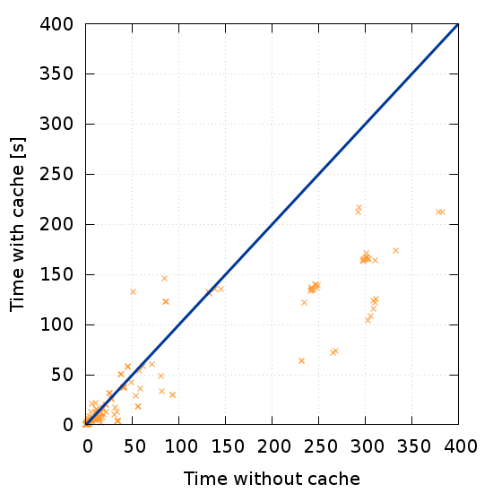

---
title: Caching SMT queries in SymDIVINE
titleshort: SymDIVINE
author:
    - Jan Mrázek
header-includes:
    - \usepackage{divine}
    - \usepackage{multirow}
    - \usepackage{tikz}
    - \usepackage{graphicx}
    - \usepackage{pbox}
    - \usepackage{booktabs}
    - \usepackage{siunitx}
    - \usetikzlibrary{shapes, arrows, shadows, positioning, calc, fit, backgrounds, decorations.pathmorphing}
    - \usetikzlibrary{trees}
    - \setbeamertemplate{caption}{\raggedright\insertcaption\par}
    - \newcommand{\columnsbegin}{\begin{columns}}
    - \newcommand{\columnsend}{\end{columns}}
    - \newcommand{\centerbegin}{\begin{center}}
    - \newcommand{\centerend}{\end{center}}
lang: english
date: 23th June 2016
aspectratio: 169
...


## SymDIVINE

- verification tool for C/C++ multi-threaded programs

- developed at ParaDiSe Laboratory

- control-explicit data-symbolic approach

. . .

```{.C}
unsigned a = input(); if (a >= 42) { ... } else { ... }
```

\begin{center}
    \resizebox{\textwidth}{!}{
    \begin{tikzpicture}[]
      \tikzstyle{every node}=[align=center, minimum width=1.75cm, minimum height=0.6cm]
      \tikzset{empty/.style = {minimum width=0cm,minimum height=1cm}}
      \tikzset{tnode/.style = {rectangle,draw=black!50,fill=black!10,thick,align=left}}
      \tikzset{dots/.style = {draw=none}}
      \tikzset{>=latex}
      \tikzstyle{outer}=[draw, dotted, thick]
      
      \tikzstyle{wave}=[decorate, decoration={snake, post length=0.1 cm}]  
      %symdivine
      \node [tnode] (s_sym) {\texttt{init}};
      \node [tnode, right = 1.2 cm of s_sym, minimum width=2cm] (s_nd_sym) {\texttt{a = \{0,\dots,$2^{32}-1$\}}};
      
      \node [empty, right = 4.5cm of s_nd_sym] (mid_sym) {};
       
      \node [tnode, above = -0.45 cm of mid_sym, minimum width=4.6cm] (s1_sym) { \texttt{a = \{0,\dots,41\}}\\\texttt{b = \{0\}}};
      \node [tnode, below = -0.45 cm of mid_sym, minimum width=4.6cm] (s2_sym) { \texttt{a = \{42,\dots,$2^{32}-1$\}}\\\texttt{b = \{1\}}};
            
      \node [empty, left  = 0.75 cm of s_sym]  (start_sym) {};
      \node [empty, right = 0.75 cm of s1_sym] (s1end_sym) {};
      \node [empty, right = 0.75 cm of s2_sym] (s2end_sym) {};
      

      
      \draw [->] (s_sym.east) -- (s_nd_sym.west) node [midway, above=0pt] {\texttt{input}};
      
      \draw [->] (s_nd_sym.east) -| ($(s_nd_sym.east) !0.2! (s1_sym.west)$) |- (s1_sym.west) node [near end, above=0pt] {\texttt{a < 42}};
      \draw [->] (s_nd_sym.east) -| ($(s_nd_sym.east) !0.2! (s2_sym.west)$) |- (s2_sym.west) node [near end, above=0pt] {\texttt{a >= 42}};
      
      \draw [wave, ->] (start_sym) -- (s_sym);
      \draw [wave, ->] (s1_sym) -- (s1end_sym);
      \draw [wave, ->] (s2_sym) -- (s2end_sym);
      
    \end{tikzpicture}
    }
\end{center}

**Goal: Optimize state representation and related machinery using caching**

## Set Representation and Related Machinery

**First order logic formula $\varphi$ represents a set of memory
configurations**

. . .

- formula transformation via interpretation of the verified program

. . .

- emptiness test

    - quantifier-free query to an SMT solver

    - fairly cheap (10 % of the verification time)

. . .

- equality test

    - quantified query to an SMT solver

    - expensive (70 % of the verification time)


## Caching Equality Queries in SymDIVINE

- naive approach has no effect

- need for smaller queries

    - symbolic execution inspired approaches do not work

. . .

**Dependency-based caching**

- combination of caching and new representation of program state
    
- splitting one memory configuration into multiple smaller ones (sub-states)


\begin{figure}[!ht]
\begin{center}
\resizebox{0.55\textwidth}{!}{
    \begin{tikzpicture}[ ->, >=stealth', shorten >=1pt, auto, node distance=1.5cm
                       , semithick
                       , scale=0.7
                       , font=\sffamily
                       , stateprog/.style={ rectangle, draw=black, very thick,
                         minimum height=2em, minimum width = 10em, inner
                         sep=6pt, text centered, node distance = 2em, align = left,  rounded corners }
                       ]

        \node[stateprog, label=Original configuration] (p1)
            {Program counter: x \\
             $a < 42~\wedge $ \\
             $a > 0~\wedge $ \\
             $b = a + 4~\wedge $ \\
             $c > 42$
             };

        \node[text centered, align = left, above right = -2.1em and 6em of p1] (pc)
            {Program counter: x};
        \node[stateprog, below = 0.5em of pc] (p2)
            {$a < 42~\wedge $ \\
             $a > 0~\wedge $ \\
             $b = a + 4$};
        \node[stateprog, below = 0.5em of p2] (p3)
            {$c > 42$};

        \node[stateprog, fit = (pc) (p2) (p3), label=New configuration] {};
    \end{tikzpicture}
    }
\end{center}
\end{figure}

## Effects of Dependency-based Caching

**We evaluated effects of our approach on SV-COMP benchmarks:**

- configuration with state splitting

    - overhead up to 200 % (except ssh-simplified and concurrency)

- configuration with caching

    - no effect (except for small benchmarks in concurrency)

- configuration with state splitting and caching:

    - in summary, almost **half** of the verification time was saved

## Benchmark results

\columnsbegin
\column{.45\textwidth}
\begin{table}
    \begin{tabular}{l@{\hskip 0.1cm}rrrrrrrr}
        Category & Time difference \\ \toprule
        bitvector & \SI{-47.5}{\percent}\\ \midrule
        eca & \SI{42.4}{\percent}\\ \midrule
        loops & \SI{-28.4}{\percent}\\ \midrule
        locks & \SI{-2.8}{\percent}\\ \midrule
        recursive & \SI{4.0}{\percent}\\ \midrule
        ssh-simplified & \SI{-40.7}{\percent}\\ \midrule
        systemc & \SI{-62.0}{\percent}\\ \midrule
        concurrency &  \SI{-47.6}{\percent}\\ \midrule
        ltl &  \SI{0.1}{\percent}\\ \bottomrule
        \textbf{summary} & \SI{-44.8}{\percent}\\
    \end{tabular}
\end{table}


\column{.55\textwidth}


\columnsend

## Conclusion

**Dependency-based caching proofed to be efficient**

- almost half of the verification time was saved

- when no speed-up is observed, only small overhead

- opens possibilities of further optimizations

. . .

**Future work:**

- merge SymDIVINE (with caching) into DIVINE

- implement extension of dependency-based caching (simplifications, subset testing)

. . .

\hfill{}Thank You!