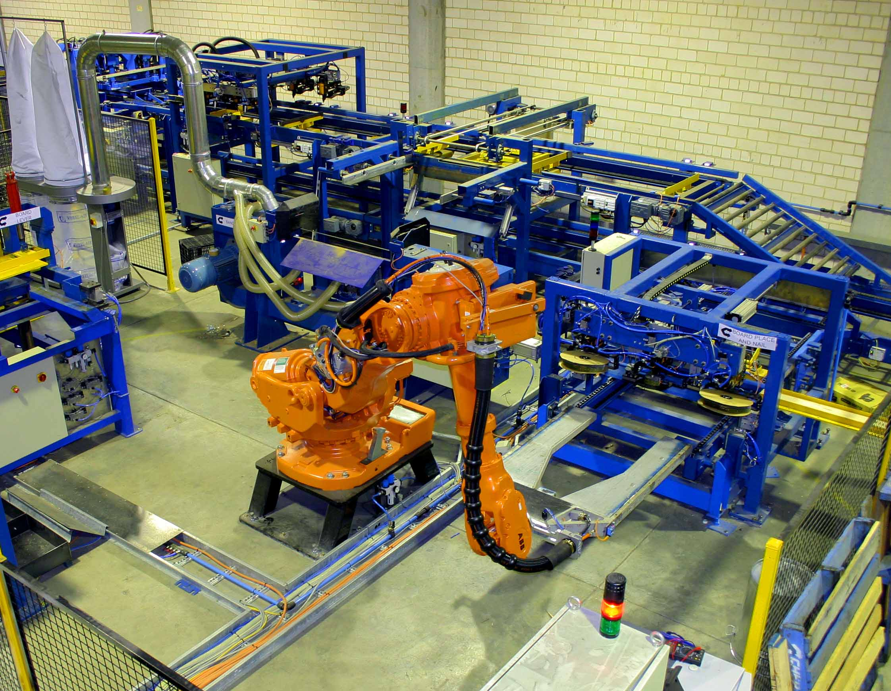
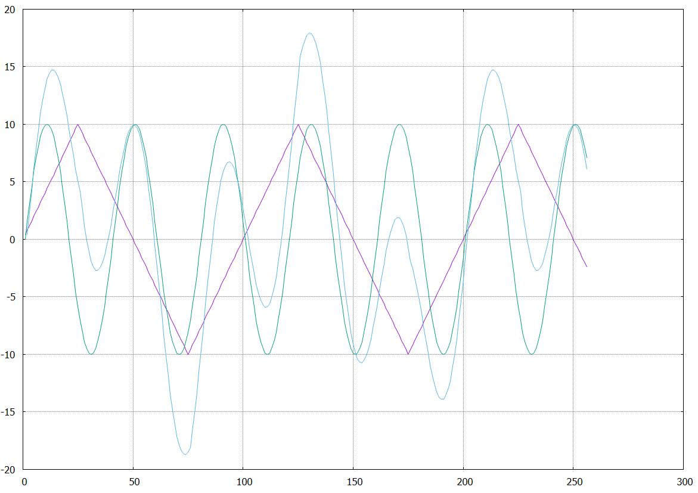

---
title: CppLink
subtitle: Tool for Data-Flow Programming
author:
    - Zuzana Baranová
    - Jan Mrázek
header-includes:
    - \setbeamertemplate{caption}{\raggedright\insertcaption\par}
    - \newcommand{\columnsbegin}{\begin{columns}}
    - \newcommand{\columnsend}{\end{columns}}
    - \usepackage{tikz}
    - \usepackage{graphicx}
    - \usetikzlibrary{shapes, arrows, shadows, positioning, calc, fit, backgrounds, decorations.pathmorphing}
aspectratio: 169
theme: "boxes"
colortheme: "whale"
...

# Data-Flow Programming


# What Is It Good For?



# Is It Really Used In Practice?

\columnsbegin
\column{.5\textwidth}


\column{.5\textwidth}

\columnsend

# CppLink


# CppLink

\begin{figure}[!ht]
\resizebox{0.9\textwidth}{!}{
    \begin{tikzpicture}[ ->, >=stealth', shorten >=1pt, auto, node distance=3cm
                       , semithick
                       , scale=0.7
                       , state/.style={ rectangle, draw=black, very thick,
                         minimum height=2em, minimum width = 4em, inner
                         sep=10pt, text centered, node distance = 2em,align=center }
                       , font=\sffamily
                       ]

      \node[state, anchor = north west] (netlist) {NetList};
      \node[state, right = 3em of netlist, rounded corners] (cpplink) {CppLink \\ Translator};
      \node[state, right = 3em of cpplink] (result) {C++ code};
      \node[state, right = 3em of result, rounded corners] (clang) {Clang};
      \node[state, below = 3em of clang] (exe) {Executable};

      \node[state, left = 6em of exe, rounded corners] (gnu) {GnuPlot};
      \node[state, below = 1em of gnu, rounded corners] (excel) {MS Excel};
      \node[state, below = 1em of excel, rounded corners] (open) {OpenOffice};
      \node[state, below = 1em of open, rounded corners] (tool) {Verification tool};


      \node[state, above = of cpplink.north, minimum width = 15em] (ltl) 
           {CppLink Data-Flow Library};

      \path (ltl.south) edge (cpplink.north)
            (netlist) edge (cpplink)
            (cpplink) edge (result)
            (result) edge (clang)
            (clang) edge (exe)
            (exe) edge (gnu)
            (exe) edge (excel.east)
            (exe) edge (open.east)
            (exe) edge (tool.east)
            ;
    \end{tikzpicture}
    }
\end{figure}


# CppLink NetList

\fontsize{12}{7.2}\selectfont

```
ModuleSaw saw
net saw.amplitude <- sawamp
net saw.period <- sawper
net saw.out -> a
net 10.0 -> sawamp
net 25.0 -> sawper

ModuleSin sin
net sin.amplitude <- sinamp
net sin.period <- sinper
net sin.out -> b
net 10.0 -> sinamp
net 10.0 -> sinper

ModuleSum<REAL> sum
net sum.in1 <- a
net sum.in2 <- b
net sum.out -> out
```

# CppLink Output



# How to Use It?


# What Modules Can I use?


# CppLink Internals

**CppLink library**

- typed I/O pins

- Primitive typed "data transformation boxes"

- Nets

**CppLink translator**

- Parser for CppLink netlists (using Flex & Bison)

- Several passes on internal representation: 

    - Type checker

    - Code generator

- Data output modules

# Live Demo!

```{.bash}
cpplink examples.cpplink output.cpp --steps=200
    --interface=csv --watch=a,b,out
```

# Summary

- Data-flow programming useful in industry

- CppLink is another tool for data-flow programming

- Easy usage

    - Hand-written code

    - Generated code

- NetList $\rightarrow$ C++ code translation

    - NetList models can be verified!