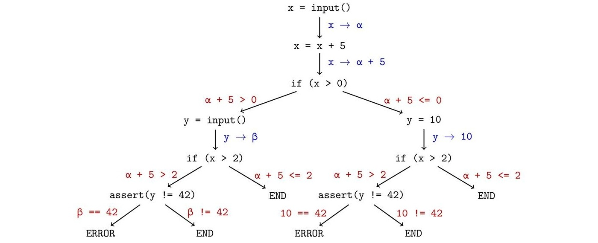

---
title: SymDIVINE
subtitle: Semi-symbolic model checking
titleshort: SymDIVINE
author:
    - Jan Mrázek
header-includes:
    - \usepackage{divine}
    - \usepackage{multirow}
    - \usepackage{tikz}
    - \usepackage{graphicx}
    - \usetikzlibrary{shapes, arrows, shadows, positioning, calc, fit, backgrounds, decorations.pathmorphing}
    - \usetikzlibrary{trees}
lang: english
date: 11th March 2016
aspectratio: 169
...

## Just another DIVINE?

DIVINE 

- explicit-state model checker

    - safety properties (memory safety, assertion safety)
    
    - LTL properties

- multiple input formalisms, main focus on LLVM

- supports almost all C/C++ features (including exception handling,
  threads, dynamic memory and standard library)
  
- efficiently utilizes all available resources to speed up the verification
  tasks
  
\pause

So why do we need "another DIVINE"?

\pause

- DIVINE can verify only programs with no inputs from the outside world 
  -- so-called "closed programs"

## SymDIVINE

- Control-Explicit/Data-Symbolic model checker

    - assertion safety
    
    - LTL properties

- single input formalism -- LLVM

- **can verify open programs**

- main focus on verification of real-world parallel C/C++ programs

- bitprecise verification

- can be downloaded at [https://github.com/yaqwsx/SymDivine](https://github.com/yaqwsx/SymDivine)


## Control-Explicit/Data-Symbolic model checker

- combination of approaches from standard explicit model-checking and
  symbolic execution

- generate and explore state-space of the verified program

    - control-flow is handled explicitly
    
    - data are handled symbolically

## Symbolic execution

- emulation of the program execution

- values of the variables are kept symbolically instead of explicit values

- this allows us to test all runs for arbitrary input values
    
\begin{latex}
    \begin{table}[]
    \centering
    \begin{tabular}{|l|l|l|}
    \hline
    program            & explicit run        & symbolic representation  \\ \hline
    \texttt{x = input()}   &                     &                          \\
                       & $x = 3$             & $x = \alpha$             \\
    \texttt{x = x * 2} &                     &                          \\
                       & $x = 6$             & $x=2\cdot\alpha$         \\
    \texttt{x = x + 1} &                     &                          \\
                       & $x = 7$             & $x=(2\cdot\alpha) + 1$   \\
    \texttt{output(x)} &                     &                          \\ \hline
    \end{tabular}
    \end{table}
\end{latex}

## Symbolic execution

- conditions in program leads to branching

    - each branch has to be explored $\rightarrow$ exponential growth

- no detection of already visited locations $\rightarrow$ potentialy infinite branches

\pause

- consider following simple C program:

\centering

```C
x = input();
x += 5;
if (x > 0)
    y = input();
else
    y = 10;    
if (x > 2)
    assert(y != 42);
```

## Symbolic execution



## Set-based reduction

Main idea: keep control flow explicit, treat data symbolically

- state-space of verified program consists of multi-states

- each multi-state represents a single control flow location and a set
  of possible data valuations
  
    - one multi-state represents multiple explicit states
  
- set of data valuations can be represented by:

    - intervals
    
    - BDDs
    
    - *SMT formulae*

- **it is possible to decide whether two states represent the same
  data valuation**
  
- these properties of multi-states allows us to reuse existing algorithms
  from explicit model checking

## Set-based reduction

    int a = __VERIFIER_nondet_int();
    if (a < 65535) {
        ...
    }
    else {
        ...
    }
        
\pause

    %a = call i32 @__VERIFIER_nondet_int()
    %b = icmp sge i32 %a, 65535
    br i1 %b, label %5, label %6
    
## Set-based reduction

DIVINE

\begin{latex}
\begin{center}
\resizebox{0.7 \textwidth}{!}{
\begin{tikzpicture}[]
    \tikzstyle{every node}=[align=center, minimum width=1.75cm, minimum height=0.6cm]
    \tikzset{empty/.style = {minimum width=0cm,minimum height=1cm}}
    \tikzset{tnode/.style = {rectangle,draw=black!50,fill=black!10,thick}}
    \tikzset{dots/.style = {draw=none}}
    \tikzset{>=latex}
    \tikzstyle{outer}=[draw, dotted, thick]
    
    \tikzstyle{wave}=[decorate, decoration={snake, post length=0.1 cm}]
    %divine
    \node [tnode] (s) {\texttt{init}};
    \node [right = 2cm of s] (mid) {};
    
    \node [tnode, above = -0.25 cm of mid, minimum width=2cm] (s65534){\texttt{a = 65534}};
    \node [tnode, below = -0.25 cm of mid, minimum width=2cm] (s65535){\texttt{a = 65535}};
    
    \node [dots, above = 0 cm of s65534] (dots1){\LARGE$\vdots$};
    \node [dots, below = -0.2 cm of s65535] (dots2){\LARGE$\vdots$};
    
    \node [tnode, above = -0.2 cm of dots1, minimum width=2cm] (s0) {\texttt{a = 0}};
    \node [tnode, below = 0 cm of dots2, minimum width=2cm] (sn) {\texttt{a = 2\textasciicircum32}};
    
    \node [tnode, right = 1.5 cm of s65534, minimum width=3cm] (s65534_icmp){\texttt{a = 65534; b = 0}};
    \node [tnode, right = 1.5 cm of s65535, minimum width=3cm] (s65535_icmp){\texttt{a = 65535; b = 1}};
    
    \node [dots, above = 0.0 cm of s65534_icmp] (dots1_icmp){\LARGE$\vdots$};
    \node [dots, below = -0.2 cm of s65535_icmp] (dots2_icmp){\LARGE$\vdots$};
    
    \node [tnode, right = 1.5 cm of s0, minimum width=3cm] (s0_icmp) {\texttt{a = 0; b = 0}};
    \node [tnode, right = 1.5 cm of sn, minimum width=3cm] (sn_icmp) {\texttt{a = 2\textasciicircum32; b = 1}};
        
    \node [empty, left  = 1 cm of s]  (start) {};
    \node [empty, right = 1 cm of s0_icmp] (s0end) {};
    \node [empty, right = 1 cm of s65534_icmp] (s65534end) {};
    \node [empty, right = 1 cm of s65535_icmp] (s65535end) {};
    \node [empty, right = 1 cm of sn_icmp] (snend) {};
    
    \begin{pgfonlayer}{background}[]
    \node[outer, fit = (s) (s0) (sn) (start) (s0end) (snend) (s0_icmp)] (tool) {};
    \end{pgfonlayer}

    \draw [->] (s.east) -| ($(s.east) !0.3! (s0.west)$) |- (s0.west) node [near end, above=1pt] {\texttt{call}} ;
    \draw [->] (s.east) -| ($(s.east) !0.3! (s65534.west)$) |- (s65534.west) node [near end, above=1pt] {\texttt{call}} ;;
    \draw [->] (s.east) -| ($(s.east) !0.3! (s65535.west)$) |- (s65535.west) node [near end, above=1pt] {\texttt{call}} ;
    \draw [->] (s.east) -| ($(s.east) !0.3! (sn.west)$) |- (sn.west) node [near end, above=1pt] {\texttt{call}} ;
    
    \draw [->] (s0) -- (s0_icmp) node [midway, above=0pt] {\texttt{icmp}};
    \draw [->] (s65534) -- (s65534_icmp) node [midway, above=0pt] {\texttt{icmp}};
    \draw [->] (s65535) -- (s65535_icmp) node [midway, above=0pt] {\texttt{icmp}};
    \draw [->] (sn) -- (sn_icmp) node [midway, above=0pt] {\texttt{icmp}};
    
    \draw [wave, ->] (s0_icmp.east) -- (s0end) node [empty, midway, above=2pt] {};
    \draw [wave, ->] (s65534_icmp.east) -- (s65534end) node [empty, midway, above=2pt] {};
    \draw [wave, ->] (s65535_icmp.east) -- (s65535end) node [empty, midway, above=2pt] {};
    \draw [wave, ->] (sn_icmp.east) -- (snend) node [empty, midway, above=2pt] {};
    
    \draw [wave, ->] (start) -- (s);
\end{tikzpicture}
}
\end{center}
\end{latex}

SymDIVINE

\begin{latex}
\begin{center}
    \resizebox{0.7\textwidth}{!}{
    \begin{tikzpicture}[]
      \tikzstyle{every node}=[align=center, minimum width=1.75cm, minimum height=0.6cm]
      \tikzset{empty/.style = {minimum width=0cm,minimum height=1cm}}
      \tikzset{tnode/.style = {rectangle,draw=black!50,fill=black!10,thick,align=left}}
      \tikzset{dots/.style = {draw=none}}
      \tikzset{>=latex}
      \tikzstyle{outer}=[draw, dotted, thick]
      
      \tikzstyle{wave}=[decorate, decoration={snake, post length=0.1 cm}]  
      %symdivine
      \node [tnode] (s_sym) {\texttt{init}};
      \node [tnode, right = 1.2 cm of s_sym, minimum width=2cm] (s_nd_sym) {\texttt{a = \{0,\dots,2\textasciicircum32\}}};
      
      \node [empty, right = 3cm of s_nd_sym] (mid_sym) {};
       
      \node [tnode, above = -0.45 cm of mid_sym, minimum width=3.7cm] (s1_sym) { \texttt{a = \{0,\dots,65534\}}\\\texttt{b = \{0\}}};
      \node [tnode, below = -0.45 cm of mid_sym, minimum width=3.7cm] (s2_sym){\texttt{a = \{65535,\dots,2\textasciicircum32\}}\\\texttt{b = \{1\}}};
            
      \node [empty, left  = 0.75 cm of s_sym]  (start_sym) {};
      \node [empty, right = 0.75 cm of s1_sym] (s1end_sym) {};
      \node [empty, right = 0.75 cm of s2_sym] (s2end_sym) {};
      
      \begin{pgfonlayer}{background}[]
      	\node[outer, fit = (s_sym) (s1_sym) (s2_sym) (start_sym) (s1end_sym) (s2end_sym)] (tool) {};
      \end{pgfonlayer}
	  
      \draw [->] (s_sym.east) -- (s_nd_sym.west) node [midway, above=0pt] {\texttt{call}};
      
      \draw [->] (s_nd_sym.east) -| ($(s_nd_sym.east) !0.2! (s1_sym.west)$) |- (s1_sym.west) node [near end, above=0pt] {\texttt{icmp}};
      \draw [->] (s_nd_sym.east) -| ($(s_nd_sym.east) !0.2! (s2_sym.west)$) |- (s2_sym.west) node [near end, above=0pt] {\texttt{icmp}};
      
      \draw [wave, ->] (start_sym) -- (s_sym);
      \draw [wave, ->] (s1_sym) -- (s1end_sym);
      \draw [wave, ->] (s2_sym) -- (s2end_sym);
      
    \end{tikzpicture}
    }
\end{center}
\end{latex}

## Input formalism overview

SymDIVINE supports LLVM as input formalism

- LLVM can be easily obtained from C/C++ using Clang

- implementation of the subset of pthread library (threads, mutexes)

- C-style or SV-COMP style assertions

- input represented by \texttt{\_\_VERIFIER\_nondet\_\{type\}} functions

- atomic sections of code can be represented by \texttt{\_\_VERIFIER\_atomic\_\{begin,end\}} functions

# Demonstration

## Example of usage -- assertion reachability

- benchmark \texttt{stateful01\_true-unreach-call}

- call \texttt{./symdivine reachability stateful01\_true-unreach-call.ll}

## Example of usage -- LTL

- benchmark \texttt{acqrel}

- property $\mathcal{G}(A\Rightarrow\mathcal{F}R)$ (property can refer to any global variable)

 - call \texttt{./symdivine ltl "G([seg1\_off1 != 0(32)] => F [seg1\_off0 != 0(32)])" acqrel.ll}

## Advantages of SymDIVINE

- real world code verification with no need for modelling

- can verify program with infinite behavior unlike symbolic execution

- bitprecise verification

    - other tools often use integral instead of bitvector representation
    
- pthread library support

- in theory no false positives

## Disadvantages of SymDIVINE

- currently no support for LLVM debug information (plan to be implemented or solved in another way)

    - counterexamples refere to internal representation with no link to source code
    
    - atomic proposition of LTL properties have to be linked against LLVM variables

- no support for symbolic pointer arithmetics and dynamic memory

- loops that deeply depend on input value may need unrolling

## Future work

- SymDIVINE supports verification of programs with inputs,
  however it lacks strong background for:

    - full LLVM support
    
    - dynamic memory
    
    - counterexamples refering to source code
    
- DIVINE offers solution to almost all of these problems

\pause

- There are plans for merge of these two tools

\pause

Thank you
