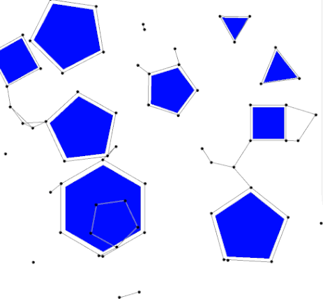

---
vim: spell spelllang=en fo+=t tw=80
title: Comparison of A* and RRT-Connect Motion Planning Techniques for Self-Reconfiguration Planning
author:
    - David Brandt
    - \linebreak
    - \linebreak
    - presented by Jan Mrázek
header-includes:
    - \usepackage{pgf, pgffor}
    - \usepackage{listings}
    - \usepackage{mathtools}
    - \usepackage{booktabs}
    - \usepackage{dirtytalk}
    - \newcommand{\columnsbegin}{\begin{columns}}
    - \newcommand{\columnsend}{\end{columns}}
lang: english
date: 26th October 2020
aspectratio: 169
...

## The Problem of Reconfiguration

- given an initial and target configuration
    - structure
    - position in space
- find a sequence of atomic actions that lead from the initial to the target
  configuration
    - collision-free
    - feasible (e.g., consider limited strength of joints)
    - optimal vs. feasible solution

. . .

**This paper:**

- tackles reconfiguration for ATRONs
- uses state-space search
    - A*
    - RRT-Connect
- provides comparison

## ATRONs

## Sidenote

- state-space of reconfiguration have high number of dimensions
- all algorithms we will present work on unlimited number of dimensions
- we will illustrate them in 2D for simplicity

## Preliminary: Probabilistic Road Map Planners

\columnsbegin

\column{.45\textwidth}

- build a discrete graph over the state space by random sampling
- use, e.g., Dijkstra to find shortest paths in the discrete graph

**Building the graph:**

- take random configuration
- if invalid, discard
- find path to an already sampled points
    - when not found - discard
    - add new vertex and edge to the graph
    - use heuristics
- repeat until dense enough graph is built

\column{.4\textwidth}

\columnsend

## Preliminary: Navigation Graph

## Preliminary: Navigation Graph

\addtocounter{framenumber}{-1}

## Preliminary: Navigation Graph

\addtocounter{framenumber}{-1}

## Preliminary: Navigation Graph

\addtocounter{framenumber}{-1}

## Preliminary: Navigation Graph

\addtocounter{framenumber}{-1}

## Preliminary: Navigation Graph

\addtocounter{framenumber}{-1}

## Preliminary: Navigation Graph

\addtocounter{framenumber}{-1}

## Preliminary: RRT

\columnsbegin

\column{.3\textwidth}

- find only path to the nearest point
- $\rightarrow$ tree

\column{.7\textwidth}

\columnsend

## RRT-Connect

\columnsbegin

\column{.4\textwidth}

**It is hard to a find path between two configurations**

- make only a step towards random configuration
- build two trees and try to connect them

\column{.6\textwidth}

\columnsend

. . .

**What is \say{a step towards a configuration?}**

## Configuration Similarity Metric

- optimal solution: minimal number of atomic steps to change one configuration
  to another
    - the problem is NP-complete (proven in 2016)

. . .

**Approximation:**

\begin{equation*}
    \text{dist}(a_1, a_2) = \text{max}(|a_{1_x}, a_{2_x}|, |a_{1_y}, a_{2_y}|, |a_{1_z}, a_{2_z}|)
    + \frac{\text{diffOri}(a_1, a_2)}{2} + \frac{\text{diffConn}(a_1, a_2)}{16}
\end{equation*}
where:
\begin{equation*}
    \text{diffOri}(a_1, a_2) =
    \begin{cases*}
      1 & if orientation of $a_1$ differs from $a_2$ \\
      0 & otherwise
    \end{cases*}
\end{equation*}

\begin{equation*}
    \text{diffConn}(a_1, a_2) = \text{number of connectors in different state}
\end{equation*}

Find pairing of modules from one configuration the other minimizing sum of distances

## Hungarian Algorithm

- solve assignment between workers and tasks
- input is matrix $n\times n$:

\begin{table}[]
\begin{tabular}{@{}rccc@{}}
\toprule
               & \textbf{Clean bathroom} & \textbf{Sweep floors} & \textbf{Wash windows} \\ \midrule
\textbf{Paul}  & 2\$                     & 3\$                   & 3\$                   \\
\textbf{Dave}  & 3\$                     & 2\$                   & 3\$                   \\
\textbf{Chris} & 3\$                     & 3\$                   & 2\$                   \\ \bottomrule
\end{tabular}
\end{table}

- minimum cost: \$6
    - Paul clean the bathroom
    - Dave sweep the floors
    - Chris wash the windows
- runs in $\mathcal{O}(n^3)$

## Configuration Similarity Metric: Putting it All Together

- prepare matrix $n\times n$ representing possible pairings
    - values in the matrix are $\text{dist}(a_x, a_y)$
    - can be computed in $\mathcal{O}(n^2)$
- find the minimal pairing using the Hungarian algorithm
    - can be computed in $\mathcal{O}(n^3)$

## RRT-Connect on ATRONs

\columnsbegin

\column{.4\textwidth}

- finding optimal $C_{Extend}$ is expensive
- the authors use 3 atomic steps as an approximation

\column{.6\textwidth}

\columnsend

## Recap: A*

- create a set `open` with the initial configuration
- create an empty set `closed`
- repeat until `open` is not empty and path have not been found:
    - get a configuration from `open` that is closest to the target configuration
    - if the distance is zero, path have been found
    - generate all successors and put them `open` if they are not in `closed`
    - put configuration into `closed`

Successors are generated as a sequence of 3 atomic steps to overcome small local
minima.

## Comparison

- limit $10^7$ states examined (~30 minutes of compute time)
- note the clear exponential increase in examined states

## Conclusion

- RRT-Connect can be perceived as \say{randomized A*}
    - it helps to move to another location before examining the whole local minima
- A* finds optimal solution, RRT-Connect finds long paths
    - RRT paths can be post-processed

. . .

**What might be interesting for RoFI:**

- ignore module ids by performing matching
- came up with similar similarity metrics
    - experimentally fine-tune parameters
- implement RRT-Connect and benchmark it