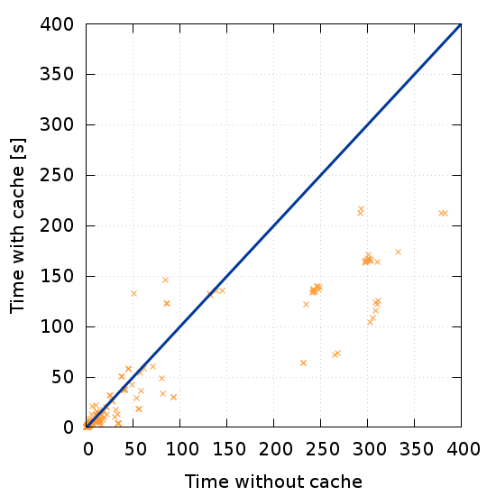

---
title: Accelerating Control-Explicit Data-Symbolic Verification
titleshort: SymDIVINE
author:
    - Jan Mrázek
header-includes:
    - \usepackage{divine}
    - \usepackage{multirow}
    - \usepackage{tikz}
    - \usepackage{graphicx}
    - \usepackage{pbox}
    - \usepackage{booktabs}
    - \usepackage{siunitx}
    - \usetikzlibrary{shapes, arrows, shadows, positioning, calc, fit, backgrounds, decorations.pathmorphing}
    - \usetikzlibrary{trees}
    - \setbeamertemplate{caption}{\raggedright\insertcaption\par}
lang: english
date: 15th June 2016
aspectratio: 43
...

# Explicit vs. Semi-Symbolic Verification Approach

## Explicit-State Model Checking

Verification approach which:

- exhaustively enumerate all possible memory configurations of verified program

- explores all possibilities when non-determinism occurs

    - great for handling scheduler

    - poor performance for data, in some cases impossible

- is implemented in DIVINE

## Control-Explicit Data-Symbolic Model Checking

Verification approach which:

- enumerate all possible **control-flow** locations with sets of corresponding
  memory configurations

- handle scheduler non-determinism in explicit manner

- handle data non-determinism by set-based reduction

- is implemented in SymDIVINE

## Set-Based Reduction

```{.C .numberLines}
unsigned a = input();
if (a < 42) {
    ...
}
else {
    ...
}
```

## Set-Based Reduction

\input{state_space.tex}

## Control-Explicit Data-Symbolic Approach Summary

- verification of programs with non-deterministic input values

- challenge: representation of memory configurations

. . .

- requirements for the representation:

    - reasonably small
    - fast
    - easy transformation
    - equality and emptiness check

# SymDIVINE

## SymDIVINE

- verification tool for C and C++ multi-threaded programs with input values

- prototype of Control-Explicit Data-Symbolic approach

- no common code with DIVINE (yet), shares the same ideology

- memory configurations represented via first-order logic formulae over
  bitvectors

## Set Representation

First-order logic formula $\varphi$ represents a set of memory configurations

- formula variables map to program variables

- model of $\varphi$ = memory configuration

. . .

Example:  $b = a + 5 \wedge b < 42 \wedge a > 2$ corresponds to a set of tuples
of $a$ and $b$: $\{(x, x + 5) \mid x \in \{2, \cdots, 37\}\}$

. . .

Advantages:

- can represent non-trivial configurations

- easy transformation (syntactic manipulation)

## Set Representation

Emptiness test:

- decide if $\varphi$ is satisfiable

- SMT solver is used

- fairly cheap (10 % of verification time)

. . .

Equality test:

- decide if two formulae represent the same configurations

- cannot be done syntactically

- quantified query to SMT solver

- expensive operation (75 % of verification time)

# Accelerating Control-Explicit Data-Symbolic Verification

## Equality Query Caching

Verification time is crucial factor for tool usability

- equality tests take most of the verification time

    - potential for a significant speed-up

- possibility of query caching

    - well-explored in area of symbolic-execution

. . .

- we implemented naive version of caching

    - cached about 2 % of queries, almost no time saved

## Dependency-based caching

Caching approaches from symbolic execution do not work due to quantification

- we developed new method -- Dependency-based caching
    
    - splitting one memory configuration into multiple smaller ones

    - on-the-fly calculation of data dependencies among variables

    - smaller and simpler queries to the solver 

\begin{figure}[!ht]
\begin{center}
\resizebox{0.8\textwidth}{!}{
    \begin{tikzpicture}[ ->, >=stealth', shorten >=1pt, auto, node distance=1.5cm
                       , semithick
                       , scale=0.7
                       , font=\sffamily
                       , stateprog/.style={ rectangle, draw=black, very thick,
                         minimum height=2em, minimum width = 10em, inner
                         sep=6pt, text centered, node distance = 2em, align = left,  rounded corners }
                       ]

        \node[stateprog, label=Original configuration] (p1)
            {Program counter: x \\
             $a < 42~\wedge $ \\
             $a > 0~\wedge $ \\
             $b = a + 4~\wedge $ \\
             $c > 42$
             };

        \node[text centered, align = left, above right = -2.1em and 6em of p1] (pc)
            {Program counter: x};
        \node[stateprog, below = 0.5em of pc] (p2)
            {$a < 42~\wedge $ \\
             $a > 0~\wedge $ \\
             $b = a + 4$};
        \node[stateprog, below = 0.5em of p2] (p3)
            {$c > 42$};

        \node[stateprog, fit = (pc) (p2) (p3), label=New configuration] {};
    \end{tikzpicture}
    }
\end{center}
\end{figure}

## Effect of Dependency-based caching

We evaluated effects of our approach on SV-COMP benchmarks

- in general, almost **half** of the verification time was saved

- usually small overhead

- some queries can be solved without a solver

## Effect of Dependency-based caching

\begin{table}
    \begin{tabular}{l@{\hskip 0.1cm}rrrrrrrr}
        \pbox{20cm}{Category  \\ name} & \pbox{20cm}{Time without \\ caching [s]} & \pbox{20cm}{Time with \\ caching [s]} & \pbox{20cm}{Percentage \\ difference} \\ \toprule
        bitvector & \SI{4821.3}{} & \SI{2531.5}{} & \SI{-47.5}{\percent}\\ \midrule
        eca & \SI{488.9}{} & \SI{696.1}{} & \SI{42.4}{\percent}\\ \midrule
        loops & \SI{81.5}{} & \SI{58.3}{} & \SI{-28.4}{\percent}\\ \midrule
        locks & \SI{243.9}{} & \SI{237.0}{} & \SI{-2.8}{\percent}\\ \midrule
        recursive & \SI{16.0}{} & \SI{16.6}{} & \SI{4.0}{\percent}\\ \midrule
        ssh-simplified & \SI{5172.0}{} & \SI{3069.5}{} & \SI{-40.7}{\percent}\\ \midrule
        systemc & \SI{5059.0}{} & \SI{1920.9}{} & \SI{-62.0}{\percent}\\ \midrule
        concurrency & \SI{943.0}{} & \SI{494.6}{} & \SI{-47.6}{\percent}\\ \midrule
        ltl & \SI{297.4}{} & \SI{297.7}{} & \SI{0.1}{\percent}\\ \bottomrule
        \textbf{summary} & \SI{17420.5}{} & \SI{9620.0}{} & \SI{-44.8}{\percent}\\ \bottomrule 
    \end{tabular}
\end{table}

## Effect of Dependency-based caching



# Conclusion

## Conclusion

**Dependency-based caching proofed to be efficient**

- almost half of the verification time was saved

- possibilities of another optimizations

. . .

**Future work:**

- merge SymDIVINE into DIVINE 4

- implement extension of Dependency-based caching (simplifications, subset testing)